<!--
 * @Author: yanxinhao
 * @Email: 1914607611xh@i.shu.edu.cn
 * @LastEditTime: 2020-11-08 01:53:34
 * @LastEditors: yanxinhao
 * @Description: 
-->
# 数据结构与算法
有个重要的事情就是把拷贝构造和等号的操作符重载好好看一下

- [数据结构与算法](#数据结构与算法)
  - [数据结构](#数据结构)
    - [介绍](#介绍)
    - [数据结构基础](#数据结构基础)
    - [线性表](#线性表)
      - [向量：](#向量)
      - [链表：](#链表)
        - [链式存储结构：](#链式存储结构)
    - [栈与队列](#栈与队列)
      - [顺序栈](#顺序栈)
      - [链式栈](#链式栈)
      - [栈的应用](#栈的应用)
    - [堆与优先队列](#堆与优先队列)
      - [堆(Heap)](#堆heap)
      - [Steap](#steap)
      - [Queap](#queap)
      - [应用](#应用)
    - [哈希表](#哈希表)
      - [hash实例应用](#hash实例应用)
    - [树](#树)
      - [树的术语](#树的术语)
      - [树的表示](#树的表示)
      - [树的遍历](#树的遍历)
        - [深度优先遍历](#深度优先遍历)
          - [Application](#application)
        - [广度优先遍历](#广度优先遍历)
      - [二叉树](#二叉树)
      - [二叉树的一些性质：](#二叉树的一些性质)
        - [二叉树的表示](#二叉树的表示)
      - [遍历二叉树](#遍历二叉树)
        - [线索二叉树](#线索二叉树)
      - [二叉树的重构](#二叉树的重构)
      - [树和森林与二叉树的相互转换](#树和森林与二叉树的相互转换)
      - [树的算法实例](#树的算法实例)
    - [并查集](#并查集)
    - [图](#图)
      - [图的性质](#图的性质)
      - [特殊图的类型](#特殊图的类型)
      - [图的存储结构](#图的存储结构)
      - [图的算法实例](#图的算法实例)
        - [图的遍历：深度优先搜索与广度优先搜索](#图的遍历深度优先搜索与广度优先搜索)
        - [优先级搜索](#优先级搜索)
        - [最小生成(支撑)树 (MST)](#最小生成支撑树-mst)
          - [Prim](#prim)
          - [Kruskal](#kruskal)
        - [最短路径 (SPT)](#最短路径-spt)
          - [Dijkstral](#dijkstral)
          - [Floid-Warshall](#floid-warshall)
        - [拓扑排序（Topological Sort）(AOV)](#拓扑排序topological-sortaov)
          - [Motivation](#motivation)
          - [Task](#task)
          - [Theorem:](#theorem)
          - [lemmas](#lemmas)
          - [Algorithm](#algorithm)
          - [Analysis](#analysis)
        - [关键路径(AOE)](#关键路径aoe)
  - [算法基础](#算法基础)
    - [算法分析基础](#算法分析基础)
      - [时间复杂度](#时间复杂度)
    - [迭代与递归](#迭代与递归)
      - [迭代算法实例](#迭代算法实例)
      - [减而治之（Decrease and conquer）](#减而治之decrease-and-conquer)
        - [减而治之的实例：](#减而治之的实例)
      - [分而治之（Divide and conquer）](#分而治之divide-and-conquer)
        - [分而治之的实例：](#分而治之的实例)
      - [递归消除：尾递归](#递归消除尾递归)
    - [动态规划](#动态规划)
    - [贪心法](#贪心法)
  - [算法实战](#算法实战)
    - [排序](#排序)
    - [字符串匹配](#字符串匹配)
    - [动态规划例子](#动态规划例子)

## 数据结构

### 介绍

### 数据结构基础

 
  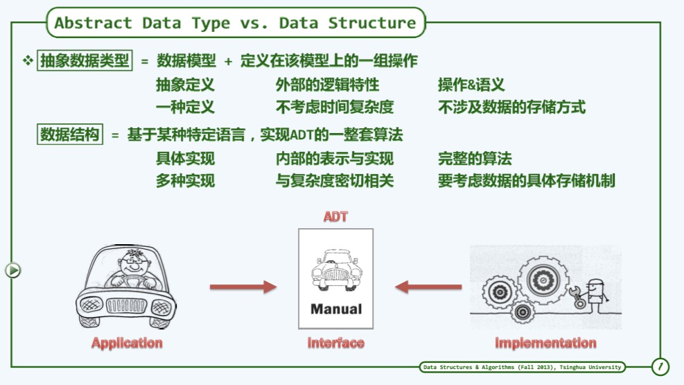 

### 线性表
#### 向量：
（线性表的顺序存储结构）

#### 链表： 
##### 链式存储结构：
  - 单链表
  - 循环链表
  - 双向链表

### 栈与队列
#### 顺序栈

#### 链式栈

#### 栈的应用
  - 逆序输出 : 进制转换
  - 递归嵌套 : 函数调用,括号匹配
  - 栈混洗 : 等价于n对括号的匹配
  - 延迟缓冲 : 中缀表达式求值
  - 逆波兰表达式（后缀表达式）求值与转换算法

### 堆与优先队列
#### 堆(Heap)
#### Steap 
> Steap = Stack + Heap = push + pop + getmax
#### Queap
> Queap = Queue + Heap = enqueue + dequeue + getMax

#### 应用
  - 试探回溯法 : n皇后问题与迷宫寻径问题

### 哈希表

#### hash实例应用
  - 桶排序

### 树

#### 树的术语
  - 节点的深度 :从根到该节点路径上的节点个数
  - 节点的高度 :从该节点往下的最长路径的节点个数
  - 树的高度 : 树中节点的最大层次（等于根节点的高度）

#### 树的表示
  - 父节点表示 : 对孩子节点和兄弟节点的访问不方便，均要遍历整个树
  - 孩子节点表示 : 找父节点和兄弟节点很慢
  - 父节点+孩子节点表示 : 这里的孩子节点是第一个孩子节点的指针,当前节点的所有孩子节点连成一个链表。
  - 长子+兄弟表示 : 若在设parent的引用, 访问parent也仅需要O(1)时间

#### 树的遍历
##### 深度优先遍历
A backtracking algorithm for stepping through a tree（回溯法）:
- At any node, proceed to the first child that has not yet been visited
- If we have visited all the children (of which a leaf node is a special case), backtrack to the parent and repeat this process

Each node is visited multiple times in such a scheme（节点会被多次访问）
- First time: before any children
- Last time: after all children, before backtracking

###### Application
Displaying information about directory structures and the files contained within
- Printing a hierarchical structure
- Determining memory usage

##### 广度优先遍历
The easiest implementation is to use a queue:
1. Place the root node into a queue
2. While the queue is not empty:
     - Pop the node at the front of the queue
     - Push all of its children into the queue

#### 二叉树
  - 二叉树:节点度数不超过2的树,同一节点的孩子和子树，均以左右区分(隐含有序)
  - 满二叉树:所有分支节点都有左孩子和右孩子,并且叶子节点都集中在二叉树的最下面一层
  - 完全二叉树:各节点的编号与对应的深度为k的满二叉树相同

#### 二叉树的一些性质：

> 设度数为0,1,2的节点各有n0,n1,n2个,则：
1. 节点数 : n = n0+n1+n2
2. 边数 : e = n-1 = n1+2*n2 (节点数减一 or 所有的出度数)
3. 叶节点数 : n0 = n2+1 (由上面2的等式后两项相等可以推出)
   
> 高度(或者深度)为k的二叉树,则:
1. 整个树最多可能有的节点数 : 2^k - 1 （等比数列求和）
2. 二叉树的第i层最多可能的节点数 : 2^(i-1)
   
> 有n个节点的完全二叉树,若i是某个节点a的编号(编号的范围为1~n)
1. 若i!=1,则a的双亲节点编号为 : ⌊i/2⌋ 
2. 若2i<=n,a的左孩子编号为 : 2i
3. 若2i>n : a无左孩子
4. 若2i+1<=n,a的右孩子的编号为 : 2i+1
5. 若2i+1>n : a无右孩子
6. 完全二叉树的高度为 : ⌊logn⌋+1 或者⌈log(n+1)⌉（底数为二）(有2^(h-1) <= n < 2^h推得)

   

##### 二叉树的表示
- 顺序存储结构 : 用一维数组，最适合完全二叉树
- 链式存储结构 : 每个节点包含一个数据域和指向两个孩子的指针域

#### 遍历二叉树
  - 先序遍历
  - 中序遍历
  - 后序遍历
  - 层次遍历
  
##### 线索二叉树

#### 二叉树的重构

#### 树和森林与二叉树的相互转换

#### 树的算法实例
  - ##### 二叉排序树（又称二叉搜索树）
  - ##### 平衡二叉树（包含AVL）
  - ##### 哈夫曼（Huffman）树和哈夫曼编码
  
  > 前缀码:任一字符的编码都不是另一字符编码串的前缀;前缀码与树的联系:根通往任一叶子节点的路径都不可能是通往其余叶子节点的子路径
  
  > 哈夫曼编码算法流程:
  1. Scan text to be compressed and count frequencies of all characters.
  2. Prioritize characters based on their frequencies in text.
  3. Build Huffman code tree based on prioritized list.
  4. Perform a traversal of tree to determine all code words.
  5. Encode the text using the Huffman codes.

  > 哈夫曼树的构造算法:
  
  While priority queue contains two or more nodes
  1. Create new node
  2. Dequeue node and make it left subtree
  3. Dequeue next node and make it right subtree
  4. Frequency of new node equals sum of frequency of left and right children
  5. Enqueue new node back into queue

  >通过遍历哈夫曼树得到哈夫曼编码

  Perform a traversal of the tree to obtain new code words
  1. Going left is a 0 
  2. Going right is a 1
  3. Code word is only completed when a leaf node is reached 

  - ##### 并查集 

### 并查集

### 图
#### 图的性质
- 支撑树(spanning tree) 
- 最小支撑树(MST)
  
#### 特殊图的类型
- 有向无环图(DAG)
  
#### 图的存储结构
  - 邻接矩阵 :
    - 空间复杂度 O(n^2)空间,与边数无关，适合稠密图
  - 邻接表
  - 十字链表 : 有向图
  - 邻接多重表 : 无向图

#### 图的算法实例
   #####  图的遍历：深度优先搜索与广度优先搜索

  边分类:
  <table>
    <tr>
  <td>BFS : 队列</td>
  <td>DFS : 栈</td>
  </tr>
    <tr>
  <td>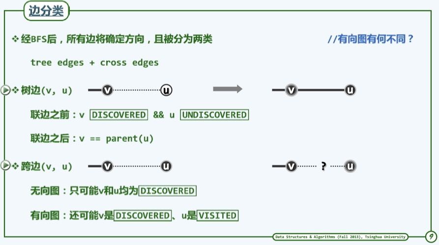</td>
  <td></td>
  </tr></table>
  
 #####   优先级搜索 

  <table>
      <tr>
      <td>通用算法</td>
      <td>统一框架</td>
      <td>统一框架</td>
    </tr>
    <tr>
      <td>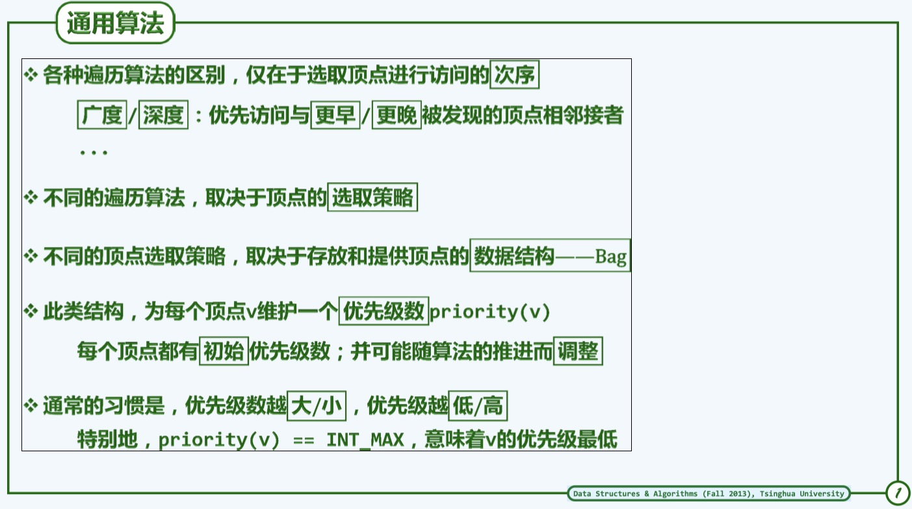</td>
      <td></td>
      <td>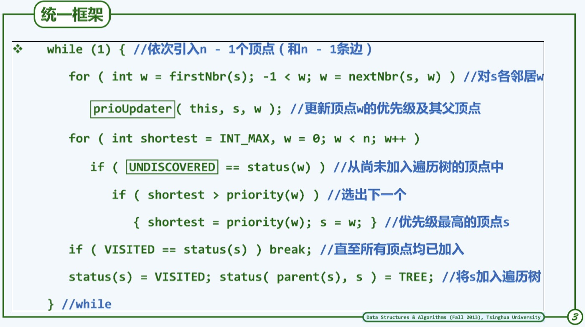</td>
    </tr>
  </table>

   #####  最小生成(支撑)树 (MST)
> 属于贪心算法
  
  ######  Prim
> prim 算法只与顶点数有关系与边数没有关系，适用于稠密图
  
  利用优先级排序的模版
    <table>
      <tr>
      <td>极短跨边</td>
      <td>极长环边</td>
    </tr>
    <tr>
      <td></td>
      <td>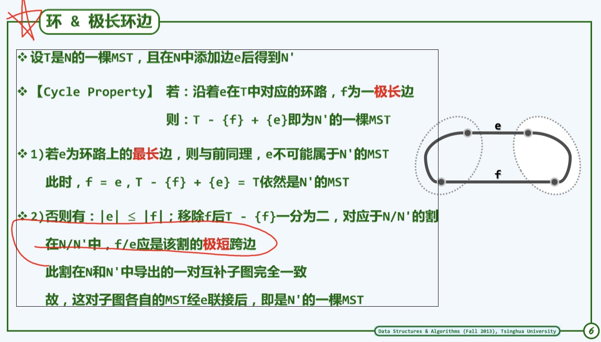</td>
    </tr>
    <tr>
      <td>算法</td>
      <td>实现</td>
    </tr>
    <tr>
      <td>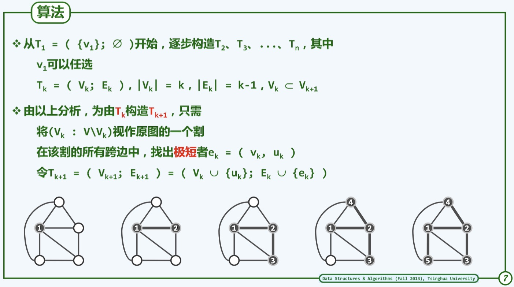</td>
      <td>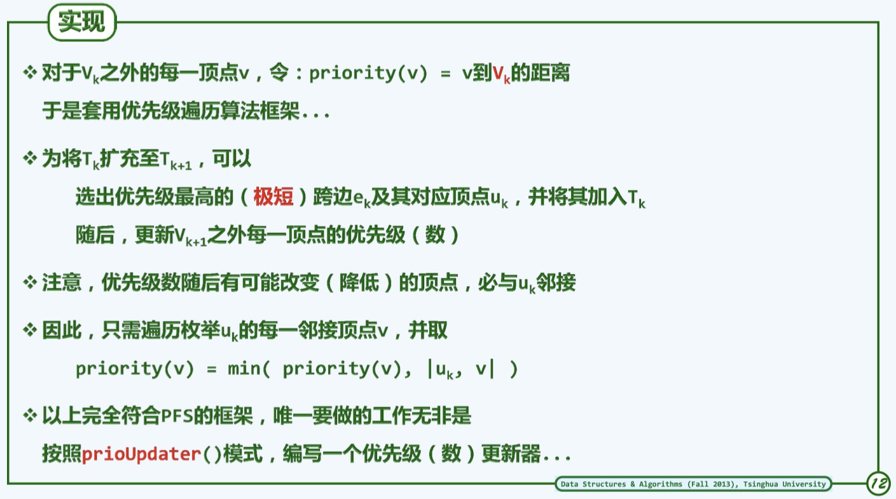</td>
    </tr>
  </table>

   ###### Kruskal
> 主要由最短边的选取算法上，所以该复杂度复杂度与顶点数无关，由边数决定。适用于稀疏图
  <table>
      <tr>
      <td>策略</td>
      <td>算法框架</td>
    </tr>
    <tr>
      <td>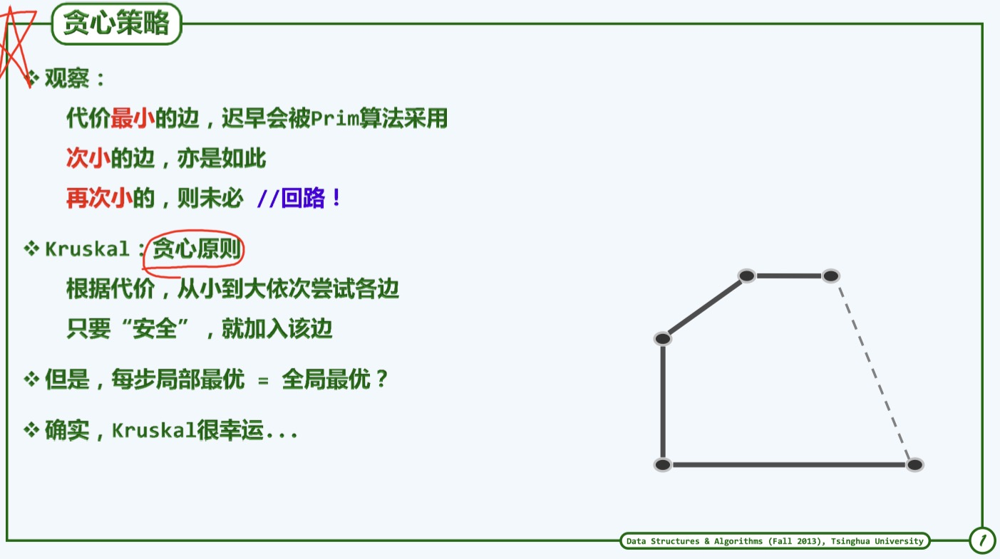</td>
      <td></td>
    </tr>
    <tr>
      <td>正确性</td>
      <td>复杂度</td>
    </tr>
    <tr>
      <td>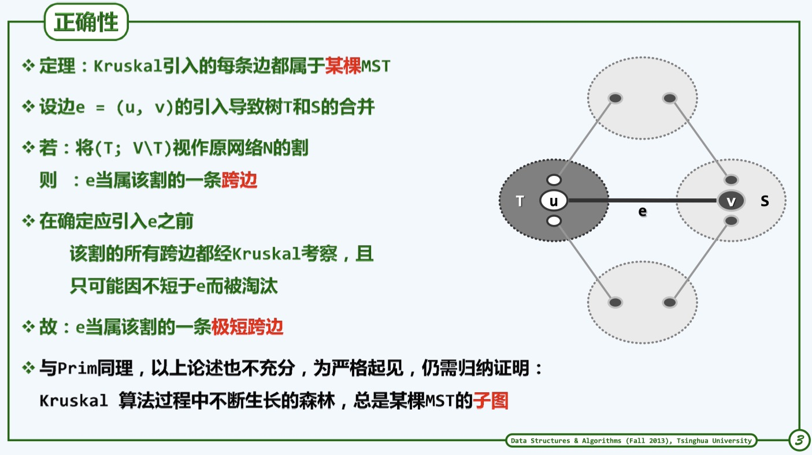</td>
      <td>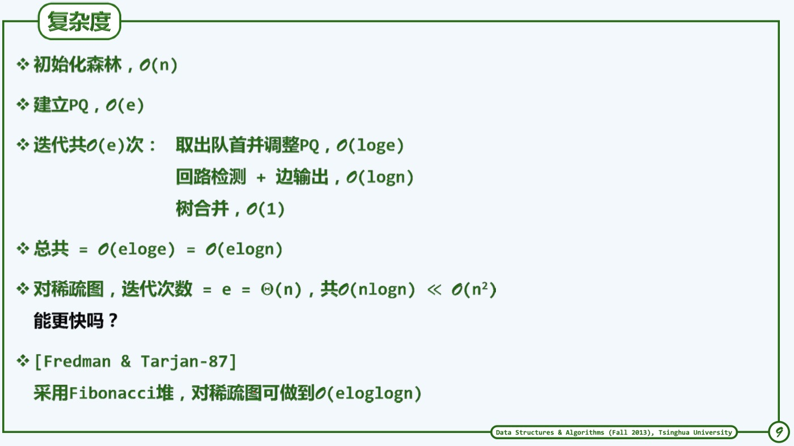</td>
    </tr>
  </table>

   #####  最短路径 (SPT)
注意 MST!=SPT 两者的优化方向并不一样
（形象的理解就是生成MST的过程是全面扩张，生成SPT的过程是以某个点为中心按路径长度发散）
  ###### Dijkstral
> 属于贪心算法
    按路径长度递增来产生一个点到其他所有点的最短路径。（从初始点按路径长度扩张）
    核心: 
      1. 被选中的节点全部是已经确认了到s的最短路径的（途径的节点全部在已被选中的节点集中）--这一点很重要
      2. 选取新的节点时，被选的新节点不可能经过其他未被选节点到s的路径最短。（新节点到s的路径只经过被选中的节点）
      3. 新的节点加入时，只影响其邻居节点到s的最短路径
  <table>
    <tr>
    <td>最短路径性质</td>
    <td>SPT与MST的优化方向不一样</td>
  </tr>
  <tr>
    <td></td>
    <td>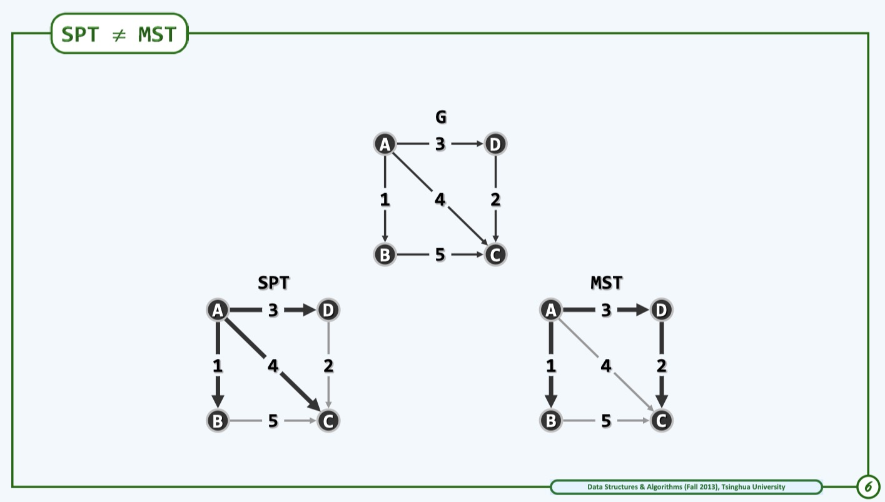</td>
  </tr>
  <tr>
    <td>算法</td>
    <td>实现</td>
  </tr>
  <tr>
    <td></td>
    <td>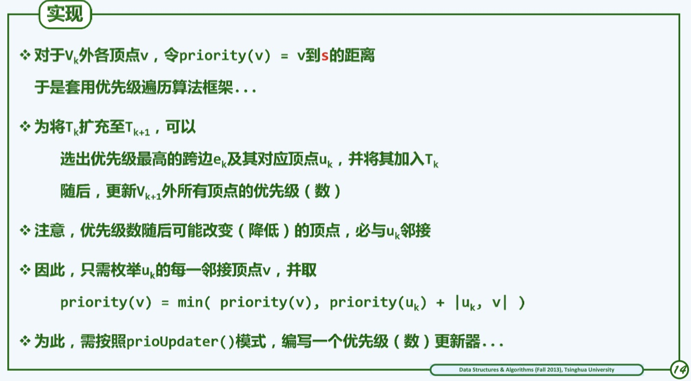</td>
  </tr>
  </table>
  
  ###### Floid-Warshall  

  <table>
    <tr>
    <td>最优解的结构特征</td>
    <td>递归实现</td>
  </tr>
  <tr>
    <td></td>
    <td></td>
  </tr>
  <tr>
    <td>动态规划</td>
    <td>实现</td>
  </tr>
  <tr>
    <td>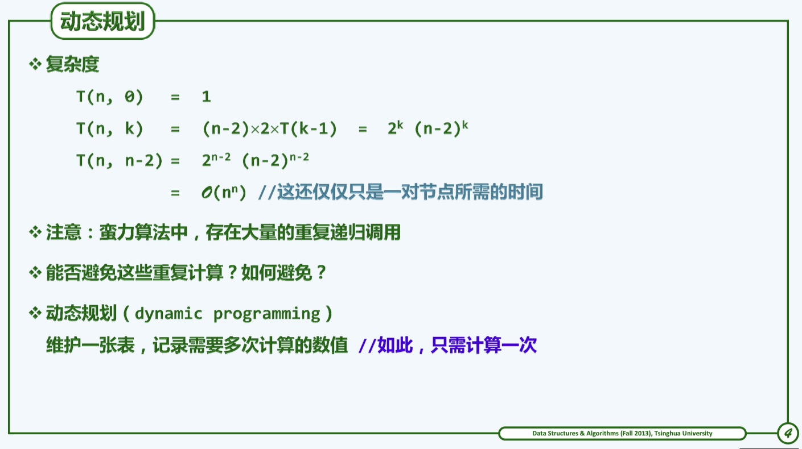</td>
    <td>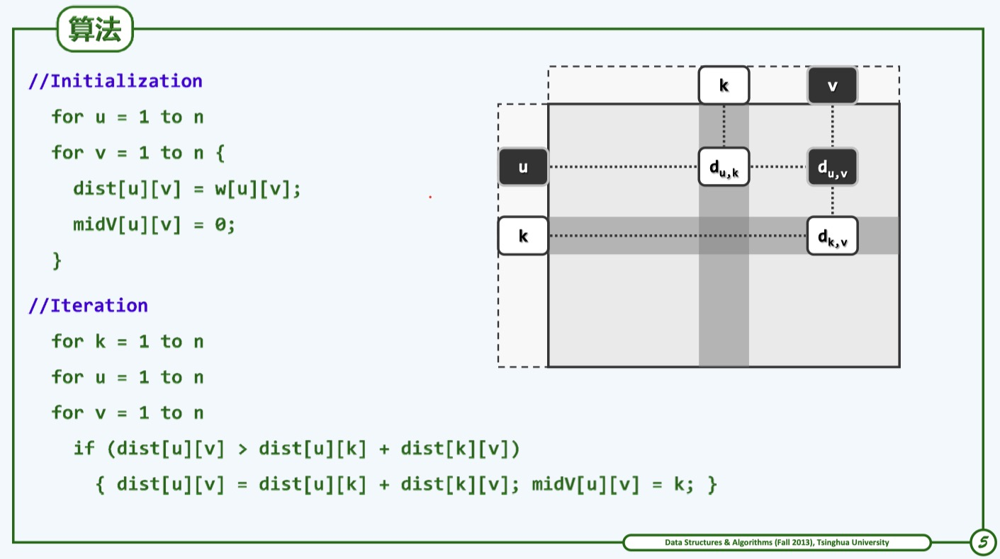</td>
  </tr>
  </table>

> 所有点对之间的最短距离,应用:搜索图的中心点

  #####   拓扑排序（Topological Sort）(AOV)
  ###### Motivation
  Dependency between tasks: one task is required to be done before the other task can be done
  Dependencies form a partial ordering 
  - A partial ordering on a finite number of objects can be represented as a directed acyclic graph (DAG)
  ###### Task
  Given a set of tasks with dependencies, is there an order in which we can complete the tasks?
  ###### Theorem:
    A graph is a DAG if and only if it has a topological sorting
    Proof strategy:
    Such a statement is of the form a ↔ b and this is equivalent to:
    a → b and b → a
  ###### lemmas
  First, we need a two lemmas:
  - A DAG always has at least one vertex with in-degree zero
    * That is, it has at least one source
  - Any sub-graph of a DAG is a DAG
  ###### Algorithm
  Idea:
- Given a DAG V, iterate:
  * Find a vertex v in V with in-degree zero
  * Let v be the next vertex in the topological sort
  * Continue iterating with the vertex-induced sub-graph V \ {v}

implement:
  - Use a queue (or other container) to temporarily store those vertices with in-degree zero
  - Each time the in-degree of a vertex is decremented tozero, push it onto the queue

  ###### Analysis

  Therefore, the run time of a topological sort is:∂
  - Q(|V| + |E|)  if we use an adjacency list
  - Q(|V|^2) if we use an adjacency matrix
  
and the memory requirements is Q(|V|)

  #####   关键路径(AOE)
> The critical time of each task is the earliest time that it could be completed after the start of execution \
The critical path is the sequence of tasks determining the minimum time needed to complete the project: \
If a task on the critical path is delayed, the entire project will be delayed

## 算法基础
### 算法分析基础

#### 时间复杂度
> 复杂度类P即为所有可以由一个确定型图灵机在多项式表达的时间内解决的问题；类NP由所有可以在多项式时间内验证它的解是否正确的决定问题组成，或者等效的说，那些可以在非确定型图灵机上在多项式时间内找出解的问题的集合。很可能，计算理论最大的未解决问题就是关于这两类的关系的：P和NP相等?

问题复杂度等级:
  - P 问题: 存在多项式算法的问题
  - NP 问题

- ##### 渐进分析
  <table>
  <tr>
  <td>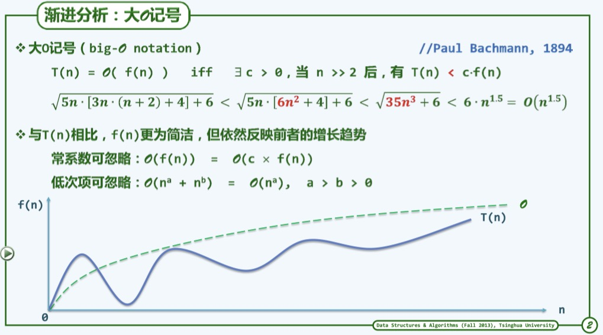</td>
  <td>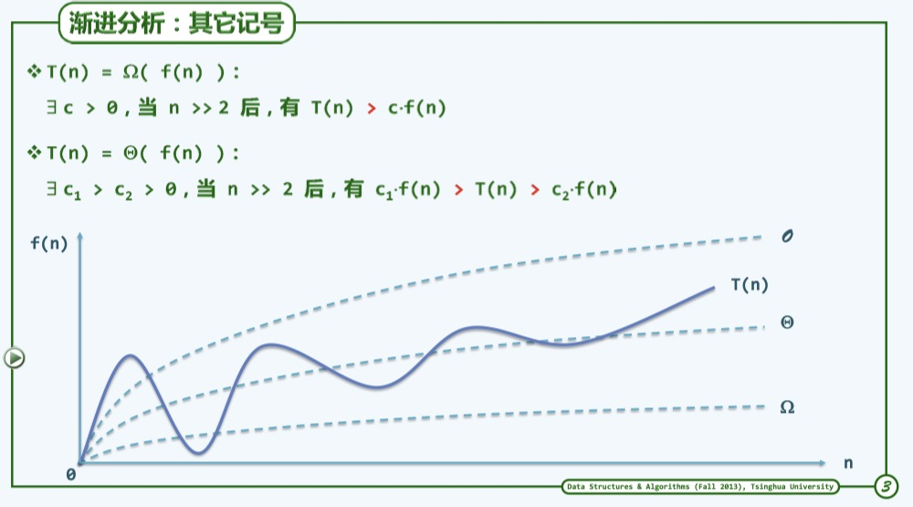</td>
  </tr></table>
  
- ##### 复杂度层次
  <table><tr>
  <td>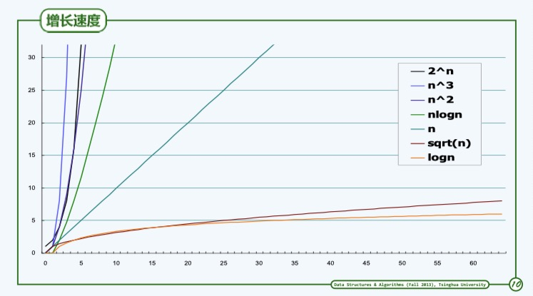</td>
  <td>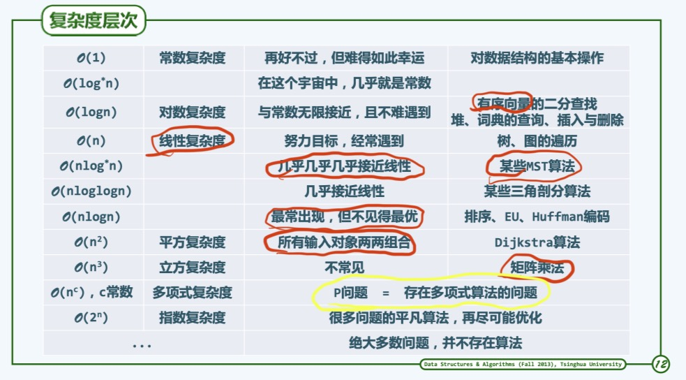</td>
  </tr></table>
- ##### 复杂度分析的主要方法：
  1. **迭代**：级数求和
  2. **递归**：递归跟踪 + 递推方程
  3. 猜测 + 验证

### 迭代与递归
迭代算法一般较为常见，递归算法更为直观。因为递归算法需要大量空间资源，所以经常需要将其改写成迭代算法，这里为体现算法的思想，我主要考虑以递归为出发点的思想来理解算法。
#### 迭代算法实例
  - 数组求和
  - 数组最大值
  
以下为递归算法的两种主要思想：
#### 减而治之（Decrease and conquer）

 
  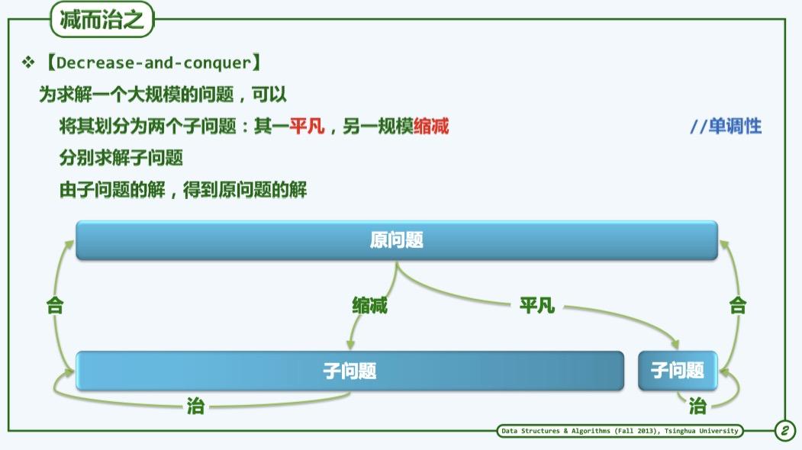 

##### 减而治之的实例：
  - 数组求和：线性递归
  - 数组倒置
#### 分而治之（Divide and conquer）

 
   

##### 分而治之的实例：
  - 数组求和：二分递归
  - 数组的最大值

| 数据结构 | 问题名称 | 问题描述                                           |
| :------: | :------: | :------------------------------------------------- |
|   数组   |   Max2   | 从数组区间A[lo,hi)中找出最大的两个整数A[x1]和A[x2] |
#### 递归消除：尾递归

 
   

### 动态规划
>朴素的递归算法(减而治之或分而治之)之所以效率低，是因为他们反复求解相同的子问题。

动态规划的原理:
- 最优子结构性质 : 问题的最优解由相关子问题的最优解组合而成，而这些子问题可以独立求解。
  
  如何发觉最优子结构?这里给出一个通用模式:
  1. 做出一个选择
  2. 假定已经知道了这种选择(先不关心这种选择如何得到)
  3. 考虑这种选择会产生哪些子问题, 以及如何最好刻画子问题空间
  4. 证明构成原问题最优解的组成部分(即每个子问题)的解就是它本身的最优解(一般是反证法)

- 重叠子问题 : 
- 重构最优解

动态规划有两种等价的实现方法:
- 带备忘的自顶向下法(top-down with memoization)
- 自底向上法(bottom-up method)

为构建动态规划的解决方案,一些必要的过程:
- 子问题图
- 重构解
  
例子:

| 数据结构 | 问题名称 | 问题描述                     |
| :------: | :------: | :--------------------------- |
|    串    |   LCS    | 求两个子序列的最长公共子序列 |

### 贪心法 

- 最小生成树
- 单源最短路径的Dijkstra算法
- 分数背包问题
## 算法实战

### 排序

简介：

|   算法名称   | 类别     | 算法描述 | 稳定性                                                                    | 就地 | 时间复杂度（最坏） | 时间复杂度（最好） | 时间复杂度（最好） |
| :----------: | :------- | :------- | :------------------------------------------------------------------------ | :--- | :----------------- | :----------------- | :----------------- |
|   冒泡排序   | 交换排序 | n        | 是                                                                        | 是   | O(n^2)             | O(n)               |                    |
|   快速排序   | 交换排序 | n        | 否                                                                        | 是   | O(n^2)             | O(nlogn)           | O(nlogn)           |
|   插入排序   | 插入排序 | n        | 把序列看成 sorted[0,)+unsorted[r,n) 两部分,把l[r]插入到有序部分的合适位置 | 是   | O(n^2)             | O(n)               | O(n^2)             |
| 一般选择排序 | 选择排序 | n        | 从未排序的元素中挑选最大者,并使其就位                                     |      | O(n^2)             | O(n^2)             | O(n^2)             |
|    堆排序    | 选择排序 | n        | n                                                                         |      | n                  | n                  |                    |
| 二路归并排序 | 归并排序 | n        | n                                                                         | 否   | O(nlogn)           | O(nlogn)           |                    |
|   基数排序   | 基数排序 | n        | n                                                                         |      | n                  | n                  |                    |

算法分析：
  <table>
      <tr>
      <td>算法描述</td>
      <td>算法分析</td>
    </tr>
    <tr>
      <td>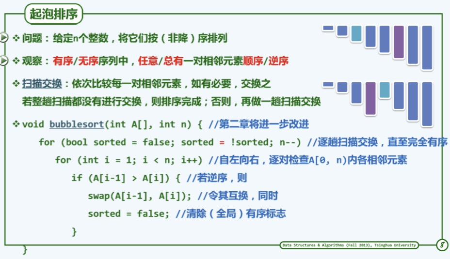</td>
      <td>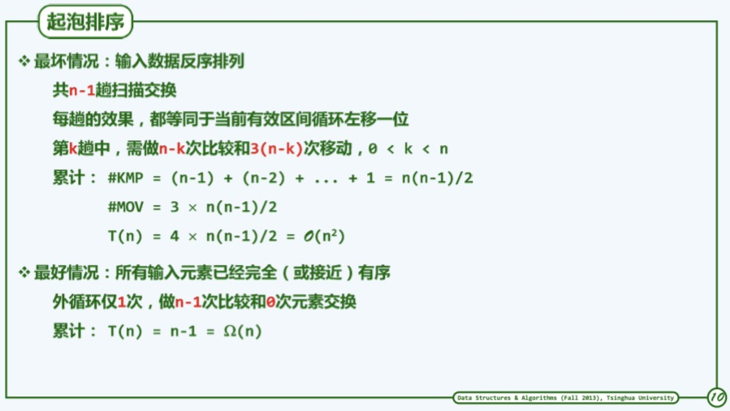</td>
    </tr>
    <tr>
      <td></td>
      <td></td>
    </tr>
    <tr>
      <td>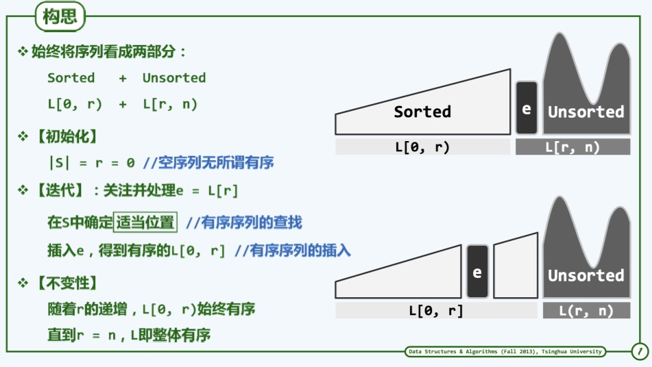</td>
      <td>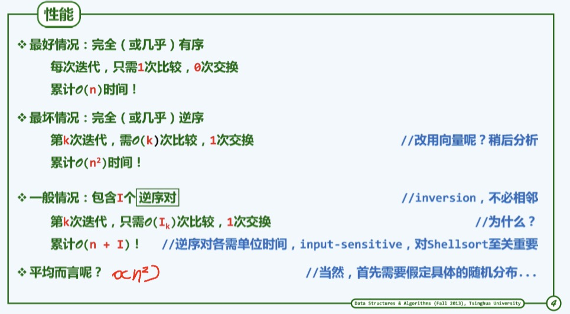</td>
    </tr>
    <tr>
      <td></td>
      <td></td>
    </tr>
    <tr>
      <td></td>
      <td></td>
    </tr>
  </table>

### 字符串匹配
| 算法名称 | 问题描述       | 算法描述 | 时间复杂度 |
| :------: | :------------- | :------- | :--------- |
|   LCS    | 最长公共子序列 | n        | n          |
|   KMP    | 字符串模式匹配 | n        | n          |

### 动态规划例子
- 钢条切割
- 矩阵链乘法
- LCS
- 0-1背包问题