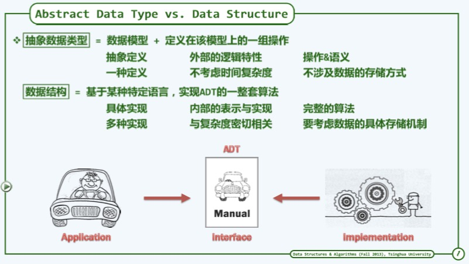

<!--
 * @Author: yanxinhao
 * @Email: 1914607611xh@i.shu.edu.cn
 * @LastEditTime: 2020-10-07 15:43:33
 * @LastEditors: yanxinhao
 * @Description: 
-->
# 数据结构与算法
- [数据结构与算法](#数据结构与算法)
  - [数据结构](#数据结构)
    - [介绍](#介绍)
    - [数据结构基础](#数据结构基础)
    - [向量](#向量)
    - [线性表](#线性表)
    - [栈与队列](#栈与队列)
    - [哈希表](#哈希表)
    - [树](#树)
      - [树的算法实例](#树的算法实例)
    - [堆与优先队列](#堆与优先队列)
    - [图](#图)
      - [图的算法实例](#图的算法实例)
  - [算法基础](#算法基础)
    - [算法分析基础](#算法分析基础)
      - [时间复杂度](#时间复杂度)
    - [迭代与递归](#迭代与递归)
      - [减而治之（Decrease and conquer）](#减而治之decrease-and-conquer)
      - [分而治之（Divide and conquer）](#分而治之divide-and-conquer)
    - [动态规划](#动态规划)
    - [贪心法](#贪心法)
  - [算法实战](#算法实战)
    - [排序](#排序)
    - [字符串匹配](#字符串匹配)

## 数据结构

### 介绍

### 数据结构基础

 
   

### 向量

### 线性表

### 栈与队列

### 哈希表

### 树
遍历二叉树
#### 树的算法实例
  - ##### 二叉排序树（又称二叉搜索树）
  - ##### 平衡二叉树（包含AVL）
  - ##### 哈夫曼（Huffman）树和哈夫曼编码
  - ##### 并查集 

### 堆与优先队列

### 图

#### 图的算法实例
  - ##### 图的遍历：深度优先搜索与广度优先搜索
  - ##### 最小生成树
  - ##### 最短路径
  - ##### 关键路径
  - ##### 拓扑排序

## 算法基础
### 算法分析基础

#### 时间复杂度

### 迭代与递归
#### 减而治之（Decrease and conquer）

 
   

#### 分而治之（Divide and conquer）

 
   

### 动态规划

| 数据结构 | 问题名称 | 问题描述 |
|:-:|:-:|:-|
|数组|Max2|从数组区间A[lo,hi)中找出最大的两个整数A[x1]和A[x2]|
|串|LCS|求两个子序列的最长公共子序列|

### 贪心法 

## 算法实战

### 排序

| 算法名称 | 问题描述 | 算法描述 | 时间复杂度 |
|:-:|:-|:-|:-|
|冒泡排序|n|n|n|
|插入排序|n|n|n|
|选择排序|n|n|n|
|快速排序|n|n|n|
|堆排序|n|n|n|
|归并排序|n|n|n|
|基数排序|n|n|n|

### 字符串匹配
| 算法名称 | 问题描述 | 算法描述 | 时间复杂度 |
|:-:|:-|:-|:-|
|LCS|最长公共子序列|n|n|
|KMP|字符串模式匹配|n|n|

